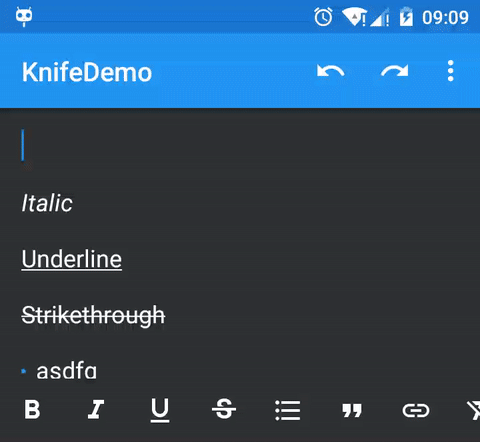

Knife
===

Knife (extend EditText) is a rich text editor component for writing documents in Android.

Just select text and use one line code to style it!

Support Android 4.0+

## Example

Here has a [demo apk](https://github.com/mthli/Knife/releases/download/v1.1/KnifeDemo.1.1.apk "KnifeDemo.1.1.apk"), and it's [source code](https://github.com/mthli/Knife/tree/master/app "KnifeDemo.1.1.apk's source code"), very easy to understand~

## Api

 - `bold(boolean valid)` __bold__ the selected text.
 
 - `italic(boolean valid)` _italic_ the selected text.
 
 - `underline(boolean valid)` \<u>underline\</u> the selected text.
 
 - `strikethrough(boolean valid)` <s>strikethrough</s> the selected text. 
 
 - `bullet(boolean valid)` bullet the selected text.
 
 - `quote(boolean valid)` quote the selected text.
 
 - `link(String link)` and `link(String link, int start, int end)` to link the text.
 
 - `contains(int FORMAT)` return `true` if the selected text contains the FORMAT.
 
 - `clearFormats()` clear all formats. 
 
 - `redo()` when text changed, you can redo it!
 
 - `undo()` when text change, you can also undo it!
 
 - `fromHtml()` import from HTML file. 
 
 - `toHtml()` export as HTML file.
 
If you want to get more control of the editable text, just extend KnifeText to get all protected method.

#### Custom

 - `app:bulletColor`
 
 - `app:bulletRadius`
    
 - `app:bulletGapWidth`
 
 - `app:historyEnable` `true` to enable record history, so you can `redo()` and `undo()`.
    
 - `app:historySize` the record max limit.
    
 - `app:linkColor`
    
 - `app:linkUnderline` `true` to enable link underline.
    
 - `app:quoteColor`
    
 - `app:quoteStripeWidth` the quote line width.
    
 - `app:quoteCapWidth`
 
#### TODO

 - Insert image.

## Gradle

At your top-level `build.gradle` file:

    repositories {
        // ...
        maven { url 'https://jitpack.io' }
    }
    
And then at your project `build.gradle` file:

    dependencies {
        compile 'com.github.mthli:Knife:v1.1'
    }
    
Done!

## Reference

 - [Spans, a Powerful Concept.](http://flavienlaurent.com/blog/2014/01/31/spans/ "Spans, a Powerful Concept.")
 
 - [Spanned | Android Developers](http://developer.android.com/reference/android/text/Spanned.html "Spanned | Android Developers")
 
 - [core/java/android/text/Html.java - Google Git](https://android.googlesource.com/platform/frameworks/base/+/master/core/java/android/text/Html.java "core/java/android/text/Html.java - Google Git")

## Thanks

 - [Squire](https://github.com/neilj/Squire "Squire")
 
 - [html-textview](https://github.com/SufficientlySecure/html-textview "html-textview")

## License

    Copyright 2015 Matthew Lee

    Licensed under the Apache License, Version 2.0 (the "License");
    you may not use this file except in compliance with the License.
    You may obtain a copy of the License at

        http://www.apache.org/licenses/LICENSE-2.0

    Unless required by applicable law or agreed to in writing, software
    distributed under the License is distributed on an "AS IS" BASIS,
    WITHOUT WARRANTIES OR CONDITIONS OF ANY KIND, either express or implied.
    See the License for the specific language governing permissions and
    limitations under the License.
